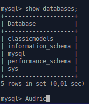

# MySQL installer :

To install MySQL, you need to update the package index on the server:

```shell
$ sudo apt update
```


Then we install the MySQL-server package :

```shell
$ sudo apt install mysql-server
```
<br />

# Configure MySQL :

Pour les nouvelles installations de MySQL il faut exécuter le script de sécurité inclus du SGBD. 
Ce script modifie certaines des options par défaut les moins sécurisées pour des éléments tels que les connexions root à distance et les exemples d'utilisateurs.
Tout d’abord, afin d’éviter une boucle récursive lors du choix du mot de passe, on doit remplacer la méthode d'authentification de l'utilisateur root par une méthode utilisant un mot de passe. 
Ainsi on utilise la commande suivante une fois dans MySQL :
```shell
mysql > ALTER USER 'root'@'localhost' IDENTIFIED WITH mysql_native_password BY 'password';
```
Puis on peut enfin lancer le script d’installation sécurisé :
```shell
$ sudo mysql_secure_installation
```
<br />

# Import a database :

To import from a link:
```shell
$ wget "url u lien"
```

Then we unzip the file :
```shell
$ unzip mysqldatabase.zip
```
(you must first install the unzip package with a command : $ sudo apt install unzip )

Finally we connect to the database :
```shell
$ mysql -u username -p < mysqlsampledatabase.sql
```
then we display it :
```shell
mysql> show databases
```
The following table then appears :



We have therefore loaded the backup file

